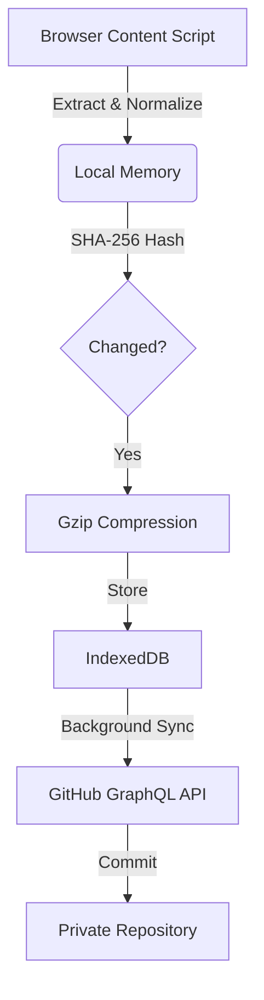

<div align="center">

# 🗨️ StoreChat

**Universal LLM Conversation Archiver for Chrome**

*Never lose an AI conversation again. Automatically backup ChatGPT, Claude, Gemini, Grok & Perplexity to GitHub.*

[](https://github.com/Adi-gitX/StoreChat/stargazers)
[](https://opensource.org/licenses/MIT)
[](https://github.com/Adi-gitX/StoreChat)
[](https://github.com/Adi-gitX/StoreChat)
[](CONTRIBUTING.md)

[🚀 Installation](#installation) • [📖 Documentation](#architecture) • [💡 Features](#capabilities) • [🤝 Contributing](CONTRIBUTING.md)

---

</div>

> **🎯 Problem**: AI platforms don't permanently store your conversation history. Accidentally delete a ChatGPT conversation? It's gone forever.
> 
> **✨ Solution**: StoreChat automatically archives every conversation to your private GitHub repository. Encrypted, compressed, searchable — yours forever.

---

## ✨ Why StoreChat?

<table>
<tr>
<td width="50%">

### 🔒 **Privacy First**
- Your data, your GitHub repo
- AES-GCM encrypted tokens
- No third-party servers
- 100% open source & auditable

</td>
<td width="50%">

### ⚡ **Zero Effort**
- Automatic background capture
- Works across 5 platforms
- Set it and forget it
- Real-time sync capability

</td>
</tr>
<tr>
<td width="50%">

### 💾 **Smart Storage**
- 90-95% compression ratio
- SHA-256 deduplication
- Batch GitHub commits
- Minimal bandwidth usage

</td>
<td width="50%">

### 🆓 **Free Forever**
- No premium tiers
- No subscriptions
- No hidden costs
- Community-driven

</td>
</tr>
</table>

---

## Capabilities

### ⚡️ Universal Capture
Seamlessly intercepts and archives conversations from major LLM providers without interrupting your workflow.
- **Support**: ChatGPT, Claude, Gemini, Grok, and Perplexity.
- **Method**: Zero-dependency DOM mutation observation with multi-strategy selector fallbacks.

### 🔐 Security & Privacy
Built with a privacy-first architecture. Your data never leaves your control.
- **Encryption**: GitHub Personal Access Tokens (PAT) are encrypted at rest using **AES-GCM** via the Web Crypto API.
- **Storage**: All data is stored locally in IndexedDB until explicitly synced.
- **Ownership**: You own the data. It is pushed directly from your browser to your private GitHub repository.

### 💾 Data Efficiency
Optimized for long-term storage and minimal bandwidth usage.
- **Compression**: Conversations are gzip-compressed (Pako) before storage, achieving **90-95% size reduction**.
- **Deduplication**: SHA-256 content hashing prevents duplicate commits or storage of unchanged conversations.
- **Batch Syncing**: Uses GitHub's GraphQL API to push up to 20 conversation files in a single commit.

---

## Supported Platforms

| Platform | Domain | Status |
| :--- | :--- | :--- |
| **ChatGPT** | `chatgpt.com` | Production |
| **Claude** | `claude.ai` | Production |
| **Gemini** | `gemini.google.com` | Production |
| **Grok** | `grok.com` / `x.com` | Production |
| **Perplexity** | `perplexity.ai` | Production |

---

## Installation

### From Source

1.  **Clone the repository**
    ```bash
    git clone https://github.com/Adi-gitX/StoreChat.git
    cd StoreChat
    ```

2.  **Load into Chrome**
    - Navigate to `chrome://extensions`
    - Enable **Developer mode** (top right)
    - Click **Load unpacked**
    - Select the `StoreChat` directory

3.  **Configuration**
    - Open the extension settings.
    - Provide a **GitHub Personal Access Token** (Classic) with `repo` scope.
    - Specify your target repository (e.g., `username/llm-archives`).

---

## Architecture

StoreChat operates as a local-first application with cloud synchronization.



### Directory Structure

```text
StoreChat/
├── manifest.json        # Extension Configuration (MV3)
├── background.js        # Service Worker & Sync Orchestrator
├── content/             # Platform-Specific Extractors
│   ├── common.js        # Core Extraction Logic
│   ├── chatgpt.js
│   ├── claude.js
│   └── ...
├── lib/
│   ├── crypto.js        # AES-GCM Encryption
│   ├── compress.js      # Gzip Utilities
│   ├── storage.js       # IndexedDB Wrapper
│   └── github.js        # GitHub API Client
└── popup/               # User Interface
```

---

## Technical Specifications

- **Runtime**: Chrome Extension Manifest V3
- **Build System**: Vanilla JS (No transpilation required for core), Vitest for testing.
- **Cryptography**: Web Crypto API (SubtleCrypto)
- **State Management**: IndexedDB + Chrome Storage Local

---

## ⭐ Show Your Support

If StoreChat helps protect your AI conversation history, please:

- ⭐ **Star this repository** on GitHub
- 🐦 **Share on Twitter/X** with #StoreChat
- 📝 **Write a blog post** about your experience
- 🤝 **Contribute** code or documentation
- 💬 **Spread the word** to friends and colleagues

[](https://github.com/Adi-gitX/StoreChat/stargazers)
[](https://twitter.com/intent/tweet?text=I%27m%20using%20StoreChat%20to%20backup%20my%20AI%20conversations!%20%F0%9F%9A%80&url=https://github.com/Adi-gitX/StoreChat&hashtags=ChatGPT,AI,OpenSource)

---

## 🙏 Acknowledgments

Built with ❤️ for the AI community by developers who've lost important conversations.

Special thanks to all [contributors](https://github.com/Adi-gitX/StoreChat/graphs/contributors) who help make StoreChat better!

---

## 📄 License

This project is licensed under the [MIT License](LICENSE).

---

## 📬 Connect & Support

- 🐛 **Bug Reports**: [GitHub Issues](https://github.com/Adi-gitX/StoreChat/issues)
- 💡 **Feature Requests**: [GitHub Discussions](https://github.com/Adi-gitX/StoreChat/discussions)
- 📖 **Documentation**: [Wiki](https://github.com/Adi-gitX/StoreChat/wiki)
- 🌟 **Star us**: Help others discover StoreChat!

---

<div align="center">

**Your AI conversations are valuable intellectual property.**  
**Protect them with StoreChat.**

[](https://star-history.com/#Adi-gitX/StoreChat&Date)

Made with 💻 and ☕ by the open source community

</div>
