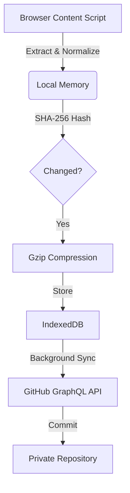

# StoreChat


**Universal LLM Conversation Archiver for Chrome**

StoreChat is a professional-grade browser extension that automatically captures, compresses, and synchronizes your AI interactions to a private GitHub repository. It creates a searchable, permanent archive of your intellectual history across multiple LLM platforms.

[Installation](#installation) • [Architecture](#architecture) • [Contributing](CONTRIBUTING.md)

---

## Capabilities

### ⚡️ Universal Capture
Seamlessly intercepts and archives conversations from major LLM providers without interrupting your workflow.
- **Support**: ChatGPT, Claude, Gemini, Grok, and Perplexity.
- **Method**: Zero-dependency DOM mutation observation with multi-strategy selector fallbacks.

### 🔐 Security & Privacy
Built with a privacy-first architecture. Your data never leaves your control.
- **Encryption**: GitHub Personal Access Tokens (PAT) are encrypted at rest using **AES-GCM** via the Web Crypto API.
- **Storage**: All data is stored locally in IndexedDB until explicitly synced.
- **Ownership**: You own the data. It is pushed directly from your browser to your private GitHub repository.

### 💾 Data Efficiency
Optimized for long-term storage and minimal bandwidth usage.
- **Compression**: Conversations are gzip-compressed (Pako) before storage, achieving **90-95% size reduction**.
- **Deduplication**: SHA-256 content hashing prevents duplicate commits or storage of unchanged conversations.
- **Batch Syncing**: Uses GitHub's GraphQL API to push up to 20 conversation files in a single commit.

---

## Supported Platforms

| Platform | Domain | Status |
| :--- | :--- | :--- |
| **ChatGPT** | `chatgpt.com` | Production |
| **Claude** | `claude.ai` | Production |
| **Gemini** | `gemini.google.com` | Production |
| **Grok** | `grok.com` / `x.com` | Production |
| **Perplexity** | `perplexity.ai` | Production |

---

## Installation

### From Source

1.  **Clone the repository**
    ```bash
    git clone https://github.com/Adi-gitX/StoreChat.git
    cd StoreChat
    ```

2.  **Load into Chrome**
    - Navigate to `chrome://extensions`
    - Enable **Developer mode** (top right)
    - Click **Load unpacked**
    - Select the `StoreChat` directory

3.  **Configuration**
    - Open the extension settings.
    - Provide a **GitHub Personal Access Token** (Classic) with `repo` scope.
    - Specify your target repository (e.g., `username/llm-archives`).

---

## Architecture

StoreChat operates as a local-first application with cloud synchronization.



### Directory Structure

```text
StoreChat/
├── manifest.json        # Extension Configuration (MV3)
├── background.js        # Service Worker & Sync Orchestrator
├── .github/             # GitHub templates & metadata
├── assets/              # Icons and static resources
├── content/             # Platform-Specific Extractors
│   ├── common.js        # Core Extraction Logic
│   └── ...
├── lib/
│   ├── vendor/          # Third-party dependencies (pako, marked, etc.)
│   ├── crypto.js        # AES-GCM Encryption
│   ├── compress.js      # Gzip Utilities
│   ├── storage.js       # IndexedDB Wrapper
│   └── github.js        # GitHub API Client
├── popup/               # User Interface
└── dashboard/           # Full-screen Dashboard
```

---

## Technical Specifications

- **Runtime**: Chrome Extension Manifest V3
- **Build System**: Vanilla JS (No transpilation required for core), Vitest for testing.
- **Cryptography**: Web Crypto API (SubtleCrypto)
- **State Management**: IndexedDB + Chrome Storage Local

## License

This project is licensed under the [MIT License](LICENSE).
